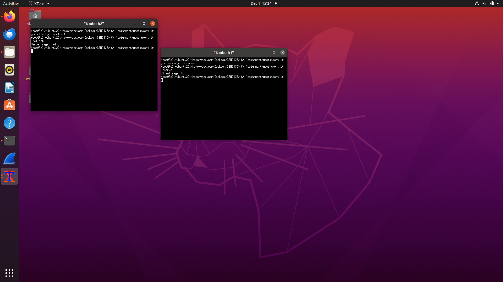

# CN Lab – Assignment 1
## Objective:
To gain first hands on experience of basic Socket Programming.

## Exercise:
Write a program to run TCP client and server socket programs where client first
says “Hi” and in response server says “Hello”.

