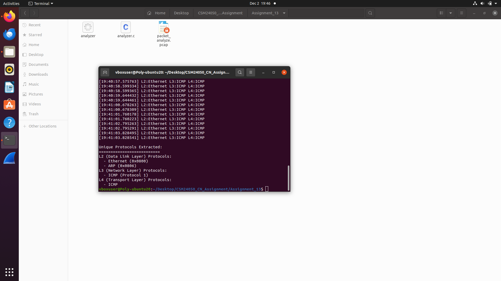

# CN Lab – Assignment 13

## Objective
To learn packet capturing and analysis.

## Exercise
Create a binary tree topology in mininet, capture packets at the root switch, extract
headers, and draw a time diagram of protocol activities during PING.

## Output Screenshot

