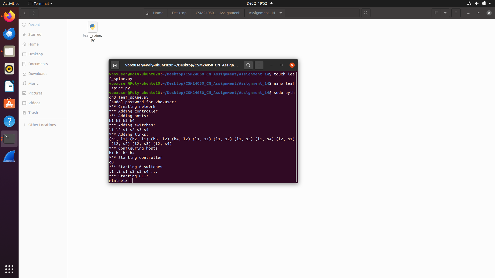

# CN Lab – Assignment 14

## Objective
Creating customized topologies in mininet.

## Exercise
Create a scalable leaf-spine topology using Python and Mininet API with increasing
switch radix.

## Output Screenshot

