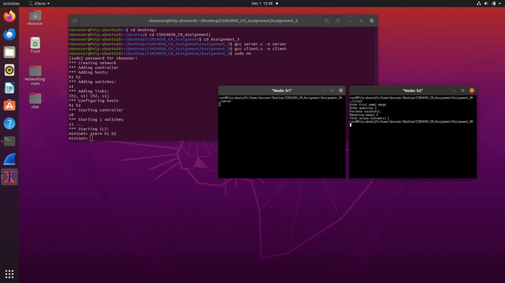

# CN Lab – Assignment 3

## Objective
To gain experience of UDP Socket Programming for simple applications.

## Exercise
Redo Assignment 2 using UDP socket programming instead of TCP.

## Output Screenshot

