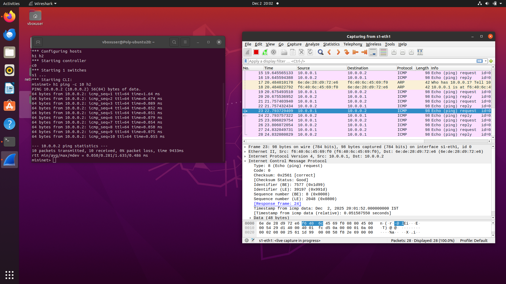

# CN Lab – Assignment 4

## Objective
To gain knowledge of packet capturing tools and understand header structures.

## Exercise
Capture packets using Wireshark during a PING operation and analyze L2, L3, and L4
headers. Draw a time diagram using the captured data.

## Output Screenshot

