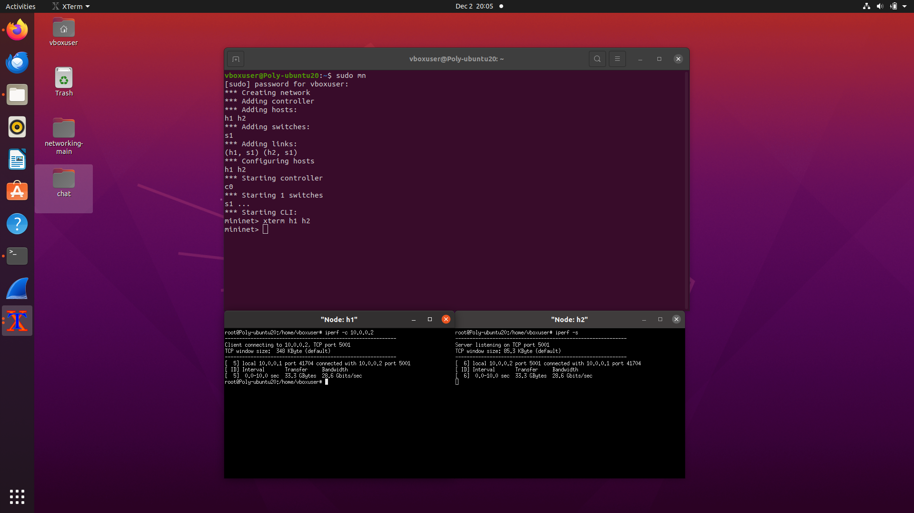

# CN Lab – Assignment 5

## Objective
To gain knowledge of packet generation tools.

## Exercise
Install and use packet generation tools such as Iperf and D-ITG to send traffic among
mininet hosts.

## Output Screenshot

