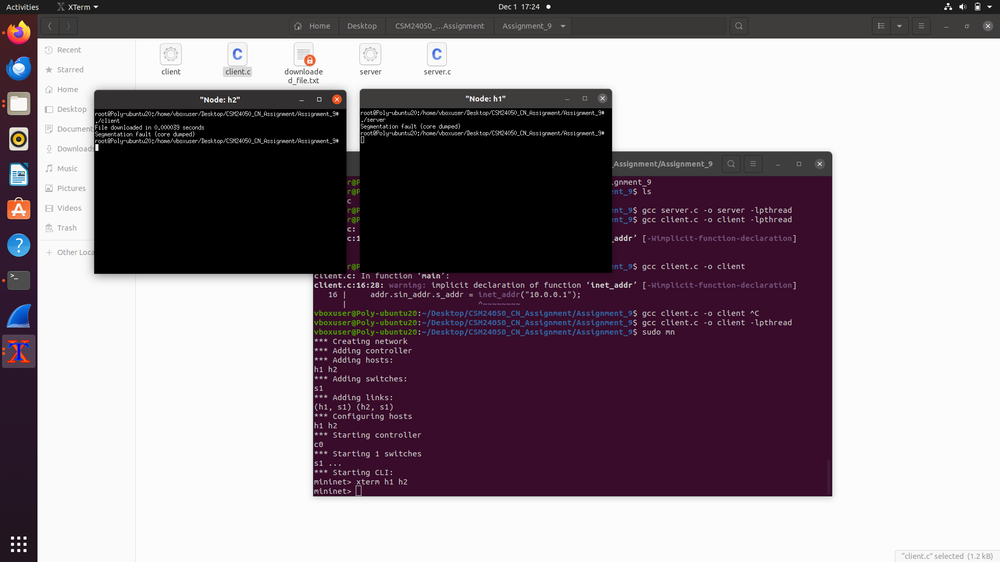

# CN Lab – Assignment 9

## Objective
File upload and download using TCP.

## Exercise
Implement TCP-based file upload and download between two hosts and calculate
transfer time for both operations.

## Output Screenshot

